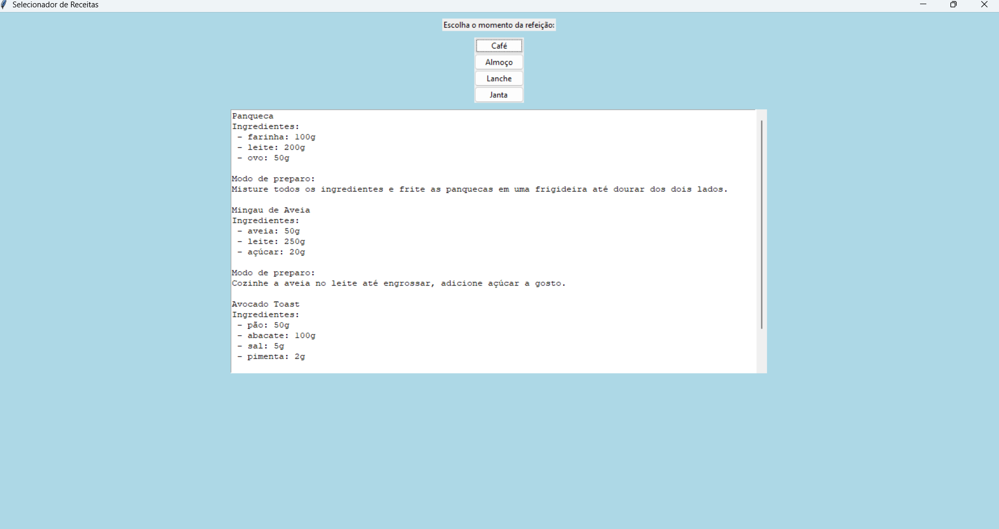

# 🍽️ Meal Recommendation CLI & GUI App

## 📚 Description

This is a Python application that helps users select and view recipes based on the moment of the day (breakfast, lunch, snack, or dinner). The project features both a **GUI interface using Tkinter** and a **CLI-based interaction**, combining data organization with user-friendly design.

Recipes are categorized, include ingredients and preparation steps, and can be scaled for different portions in the case of lunch or dinner meals.

---

## 🛠️ Technologies Used

- Python 3.x  
- Tkinter (`tk`, `ttk`, `scrolledtext`)  
- Object-Oriented Programming (Inheritance and Encapsulation)  
- Terminal interaction (`input()`)

---

## 🚀 How to Run

```bash
# Clone the repository
git clone https://github.com/andre-maccarini/meal-recommendation-cli-app.git

# Navigate into the project folder
cd meal-recommendation-cli-app

# Run the app
python main.py
```

## 🎮 Preview



## 🧠 What I Learned
How to design a program with GUI and CLI in the same flow

How to structure classes for domain-specific data (recipes)

How to use inheritance to extend behavior (scaling ingredients)

Managing state between logic and interface

## 📈 Possible Improvements
 Add an option to edit or add new recipes during runtime

 Save/load recipes from a JSON file

 Translate interface and recipes to English

 Deploy GUI version as standalone .exe using PyInstaller

## ✍️ Author
André Maccarini